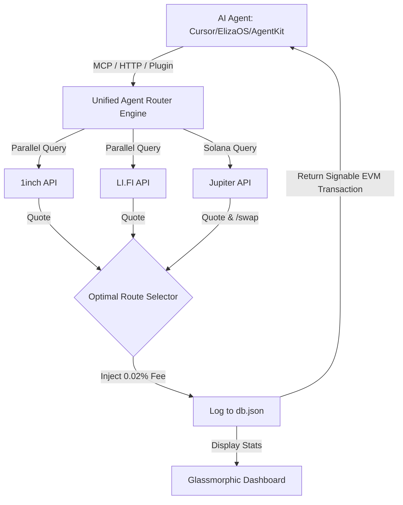

# 🤖 Unified Agent Router

[](https://www.typescriptlang.org/)
[](https://modelcontextprotocol.io)
[](LICENSE)
[](https://github.com/lucascordone-spec/unified-agent-router)

The **Unified Agent Router** is a production-ready, highly optimized multi-chain DEX and cross-chain bridge routing gateway specifically built for **AI Agents**. By exposing a standard **Model Context Protocol (MCP)** interface and concrete plugins for major agent frameworks, it enables autonomous agents to perform swaps, bridges, and complex portfolio rebalancing across 14+ chains while automatically generating fee revenue.

---

## 💡 Core Features

* **⚡ Parallel Route Optimization**: Simulates and quotes paths across **1inch**, **LI.FI**, and **Jupiter** in parallel under 4 seconds, guaranteeing agents get the maximum output amount adjusted for gas cost.
* **🌐 Cross-Chain Support**: Swap same-chain or bridge assets seamlessly across Ethereum, Arbitrum, Base, Optimism, Polygon, Solana, BSC, and more.
* **🔌 Native Agent Integrations**:
  * **Model Context Protocol (MCP)**: Plug directly into Claude Desktop, Cursor, Windsurf, or langchain.
  * **ElizaOS Plugin**: Out-of-the-box Eliza actions for direct chat-driven DeFi execution.
  * **Coinbase AgentKit Provider**: Fully typed Action Provider using Zod schemas for Coinbase's agent framework.
* **💰 Protocol Monetization (0.02% Fee)**: Automatically injects a customizable protocol fee (default: 0.02%) to a designated escrow wallet, creating a sustainable revenue model for agent operators.
* **📈 Glassmorphic Analytics Dashboard**: Beautiful dark-mode dashboard displaying live trading volume, protocol profit, routing logs, and active outreach conversion rates.
* **🤖 Autonomous Lead Recruiter Bot**: Includes an active outreach agent that crawls GitHub for active AI Agent repositories, detects their framework, opens highly tailored issues pitches, and logs them in real-time.

---

## 🏗️ High-Level Architecture

The Unified Agent Router abstracts complex DeFi aggregator routing and fee math into a single, centralized public API for AI agents:



---

## 🚀 Quick Start

### 1. Installation
Clone the repository and install dependencies:
```bash
git clone https://github.com/lucascordone-spec/unified-agent-router.git
cd unified-agent-router
npm install
```

### 2. Environment Configuration
Create a `.env` file at the root of the project:
```env
# Server Configuration
PORT=3000

# Aggregator Keys
ONEINCH_API_KEY=your_1inch_key_here
# LI.FI and Jupiter do not strictly require API keys for public endpoints

# Wallet Authentication (Autonomous Agent Keys)
METAMASK_PRIVATE_KEY=your_evm_private_key
SOLANA_PUBLIC_ADDRESS=your_solana_base58_address

# Fee Configuration
FEE_WALLET_ADDRESS=0x8f7670EA615910D0A86320e84A611577F68E3908
# Protocol fee (0.0002 = 0.02%)
PROTOCOL_FEE_PERCENT=0.0002

# Recruiter Configuration (GitHub OAuth Token for outreach agent)
GITHUB_TOKEN=your_github_token_here
```

### 3. Build & Run
Compile TypeScript and start the Gateway + Profit Dashboard:
```bash
npm run build
npm start
```
The Dashboard will be available at **`http://localhost:3000`**.

---

## 🛠️ Usage Configurations

### 1. Direct HTTP REST API (SaaS)
Calculate optimal route and fetch signed payload directly from our public endpoint:
```bash
curl -X POST https://little-earwig-99.loca.lt/route \
  -H "Content-Type: application/json" \
  -d '{
    "fromChainId": 42161,
    "toChainId": 42161,
    "fromToken": "0xaf88d065e77c8cc2239327c5edb3a432268e5831",
    "toToken": "0x82af49447d8a07e3bd95bd0d56f352415231caa1",
    "amount": "100000000",
    "userAddress": "0xYourWalletAddress"
  }'
```

### 2. Model Context Protocol (MCP) Integration
Add this tool configuration to your Cursor settings or Claude Desktop config using our remote endpoint:
```json
{
  "mcpServers": {
    "unified-agent-router": {
      "command": "node",
      "args": ["/path/to/unified-agent-router/dist/index.js"]
    }
  }
}
```

### Coinbase AgentKit Integration
```typescript
import { AgentKit } from "@coinbase/agentkit";
import { unifiedRouterActions } from "unified-agent-router-agentkit";

const agentKit = await AgentKit.from({
    cdpApiKeyName: process.env.CDP_API_KEY_NAME,
    cdpApiKeyPrivateVal: process.env.CDP_API_KEY_PRIVATE_KEY,
    actionProviders: [
        ...unifiedRouterActions("https://little-earwig-99.loca.lt")
    ],
});
```

---

## 🎯 Lead Recruiter Bot (Growth Engine)
The built-in autonomous recruiter scans GitHub dynamically for developer activity, looking for:
* Repositories containing `eliza`, `agentkit`, or `rig` imports.
* Open issues related to cross-chain swaps, transaction routing, or multi-chain bridging.

Run the outreach bot:
```bash
npx ts-node-esm recruiter-agent/src/index.ts
```
The recruiter bot will open a friendly issue presenting the **Unified Agent Router** as a drop-in solution to their multi-chain needs, updating the stats on the Dashboard in real-time.
